# KSU SWE 3643 Software Testing and Quality Assurance Semester Project: Web-Based Calculator
---
## Introduction
This repository contains the semester project for the KSU SWE 3643 Software Testing and Quality Assurance course. The project is a web-based calculator application designed to demonstrate software testing principles, including unit testing, end-to-end testing, and test coverage analysis. It also includes a final video presentation showcasing the project's outcomes.

---

## Table of Contents
1. [Team Members](#team-members)
2. [Architecture](#architecture)
3. [Environment](#environment)
4. [Executing the Web Application](#executing-the-web-application)
5. [Executing Unit Tests](#executing-unit-tests)
6. [Reviewing Unit Test Coverage](#reviewing-unit-test-coverage)
7. [Executing End-To-End Tests](#executing-end-to-end-tests)
8. [Final Video Presentation](#final-video-presentation)

---

## Team Members
- Member 1: Lan Vu, Documentation
- Member 2: Nino, Developer

## Architecture

## Calculator Logic Module
This module encapsulates the core logic of the calculator app. Each class and method is responsible for a distinct task, ensuring modularity and maintainability:

1. **DescriptiveStatistics**  
   Handles descriptive statistical computations, such as calculating the mean, standard deviation, and other summary statistics.

2. **LinearRegression**  
   Handles calculations related to linear regression, including generating formulas and predicting values based on input data.

3. **ValidationFunctions**  
   Ensures input data is validated for accuracy, completeness, and adherence to expected formats.

4. **LogicFunctions**  
   Provides utility methods that serve as helpers for core calculations. These methods are reusable across different modules.

5. **CalculationResult**  
   A utility class designed to encapsulate the results of computations. It provides a standardized way of returning the calculation outputs along with relevant metadata, such as error messages or calculation status.

Both DescriptiveStatistics and LinearRegression utilize ValidationFunctions and LogicFunctions.
CalculationResult is used across modules to standardize the computation output.

# Testing Frameworks: Unit Testing and E2E Tools

## Calculator Logic Unit Tests via JUnit
This component tests the core functionality of the logic module using unit tests written in **JUnit**. These tests ensure the reliability and correctness of the core calculations.

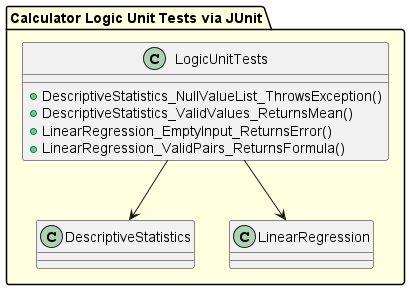
### Test Cases:
1. **DescriptiveStatistics_NullValueList_ThrowsException()**  
   Ensures that null values are handled properly and appropriate exceptions are thrown.

2. **DescriptiveStatistics_ValidValues_ReturnsMean()**  
   Tests the computation of the mean for valid input values.

3. **LinearRegression_EmptyInput_ReturnsError()**  
   Validates that an error is returned when the input for linear regression is empty.

4. **LinearRegression_ValidPairs_ReturnsFormula()**  
   Tests the generation of the linear regression formula for valid input pairs.

---

## Calculator End-to-End Tests via Playwright
These tests verify the system's functionality as a whole by simulating real-world scenarios using **Playwright** for browser automation. The focus is on ensuring that the application behaves as expected from the user's perspective.
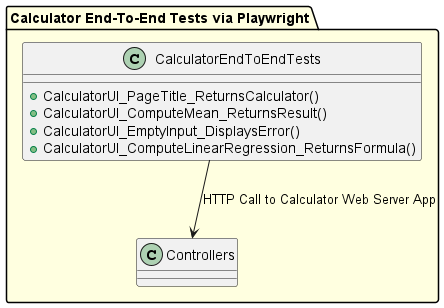
### Test Cases:
1. **CalculatorUI_PageTitle_ReturnsCalculator()**  
   Validates that the page title is displayed correctly in the browser.

2. **CalculatorUI_ComputeMean_ReturnsResult()**  
   Tests the user interface flow for calculating the mean and returning a result.

3. **CalculatorUI_EmptyInput_DisplaysError()**  
   Ensures that the application displays proper error messages when the input field is empty.

4. **CalculatorUI_ComputeLinearRegression_ReturnsFormula()**  
   Tests the UI flow for performing linear regression and displaying the resulting formula.


This combination of unit and end-to-end testing ensures both the correctness of individual components and the seamless integration of the entire system.

- **Deployment:** [Hosting platform/environment]

---

## Environment
To set up and run the project, the following environment is required:
## Prerequisites
- **Java 21** is required.
- **Maven** is required.
- **Node.js** is required.

**Check Java Installation** 

1. Open a terminal (Command Prompt, PowerShell, or a Linux/Mac terminal) and type: 

   ```bash
   java -version

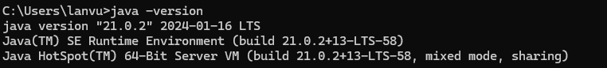

If Java is Not Installed: You'll see an error like 'java' is not recognized as an internal or external command.... 

**Verify JDK Installation** 

2. To confirm the JDK is correctly installed, type: 
   ```bash
   javac -version 
    
**Expected Output:** 
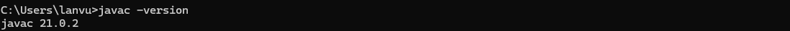

**Check JAVA_HOME Environment Variable**

On Windows:

```terminal
echo %JAVA_HOME%
```
   Expected Output: 

   C:\Program Files\Java\jdk-21 

   On Linux/Mac: 
```bash
   echo $JAVA_HOME 
```
   Expected Output: 

   /usr/lib/jvm/java-21-openjdk-amd64 

   3. **Verify PATH Configuration** 

   Ensure the bin directory of JDK 21 is in your system PATH: 

   On Windows: 
   ```terminal
   echo %JAVA_HOME% 
   ```
**Look for:**

C:\Program Files\Java\jdk-21\bin 

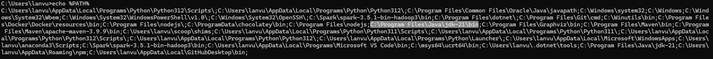

On Linux/Mac: 
```bash
echo $PATH 
```

***Look for:*** 

/usr/lib/jvm/java-21-openjdk-amd64/bin 

Shape 

**Install Prerequisites** 

If Java 21 is not installed: 

Download and install JDK 21 from the [official site](https://www.oracle.com/java/technologies/javase-downloads.html).


5. Set the ***JAVA_HOME*** environment variable and add the bin directory to your system's PATH. 

For Maven and Node.js: 

Install Maven from [Maven Downloads](https://maven.apache.org/download.cgi).


**Verify that Maven is installed** 

mvn -version 

Look for the Java version listed. Verify that ***Java 21*** is used. If this shows ***Java 17*** or an earlier version, Maven is not using the correct JDK. 

**Set the Correct JDK for Maven** 

Maven uses the JDK specified in your JAVA_HOME environment variable. 

6. Set **JAVA_HOME** to the path of JDK 21: 

7. Set **JAVA_HOME**=C:\Program Files\Java\jdk-21 

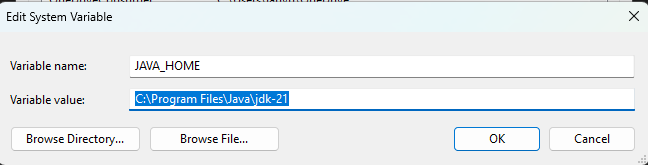

8. set PATH=%JAVA_HOME%\bin;%PATH% 

**Verify Maven now uses JDK 21:** 

mvn -v 

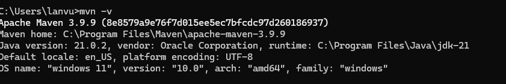

**Install Node.js from the [official site](https://nodejs.org/).**


**Verify that Node is installed** 

node -v 

npm -v 

 ---

## Executing the Web Application

**To execute the web application locally:**
1. Clone the repository:  
   ```bash
   git clone https://github.com/ninuljaja/SWE3643-QA-Project.git


**Install Dependencies** 

2. Navigate to the root directory of the repository : 
```bash
cd SWE3643-QA-Project 
```

3. **Install Maven dependencies without running tests:** 
```terminal
mvn clean install -DskipTests 
```
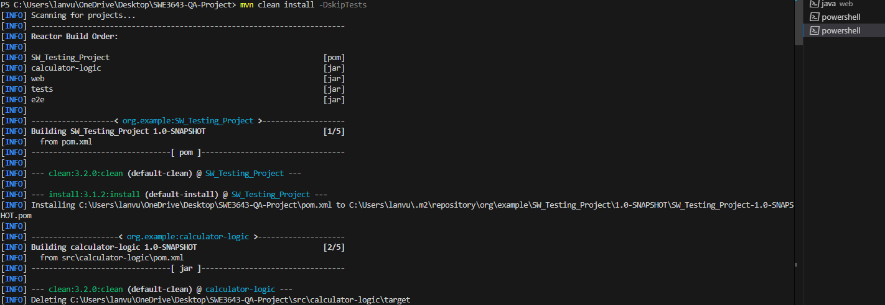


4. **Set up Playwright for end-to-end tests:** 
```bash
npx playwright install 
```

**Running the Application** 

To run the application locally: 

5. Navigate to the web module directory: 
```bash
cd src/web 
```

6. **Start the application:** 
```bash
mvn spring-boot:run
```
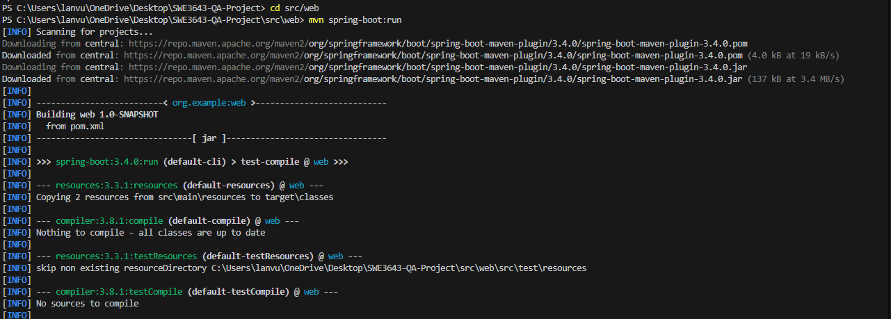
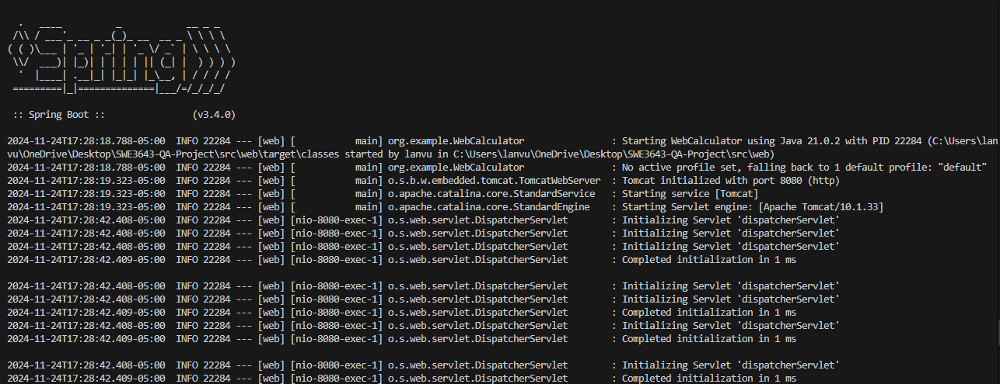

7. Once started, open a browser and connect to: 

http://localhost:8080 

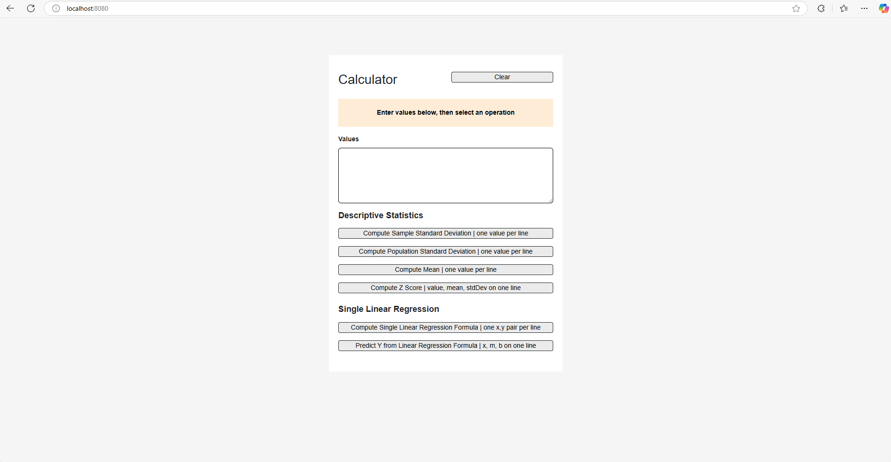

**Running Tests** 

8. To execute tests run: 
```bash
mvn test 
```
---

## Executing Unit Tests
## Reviewing Unit Test Coverage
## Executing End-To-End Tests
## Final Video Presentation