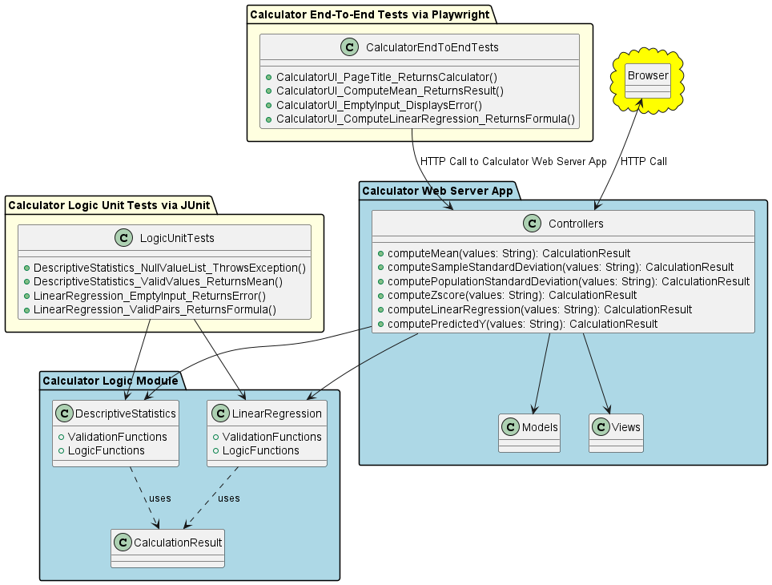

# KSU SWE 3643 Software Testing and Quality Assurance Semester Project: Web-Based Calculator

This repository contains the semester project for the KSU SWE 3643 Software Testing and Quality Assurance course. The project is a web-based calculator application designed to demonstrate software testing principles, including unit testing, end-to-end testing, and test coverage analysis. It also includes a final video presentation showcasing the project's outcomes.

## Table of Contents
1. [Team Members](#team-members)
2. [Architecture](#architecture)
3. [Environment](#environment)
4. [Executing the Web Application](#executing-the-web-application)
5. [Executing Unit Tests](#executing-unit-tests)
6. [Reviewing Unit Test Coverage](#reviewing-unit-test-coverage)
7. [Executing End-To-End Tests](#executing-end-to-end-tests)
8. [Final Video Presentation](#final-video-presentation)

## Team Members
- Member 1: Lan Vu, Documentation
- Member 2: Nino, Developer

## Architecture
The web-based calculator application is built using the following architecture:



- **Testing Frameworks:** [Unit testing and E2E tools]
- **Deployment:** [Hosting platform/environment]

## Environment
To set up and run the project, the following environment is required:

## Executing the Web Application
To execute the web application locally:
1. Clone the repository:  
   ```bash
   git clone https://github.com/ninuljaja/SWE3643-QA-Project.git
